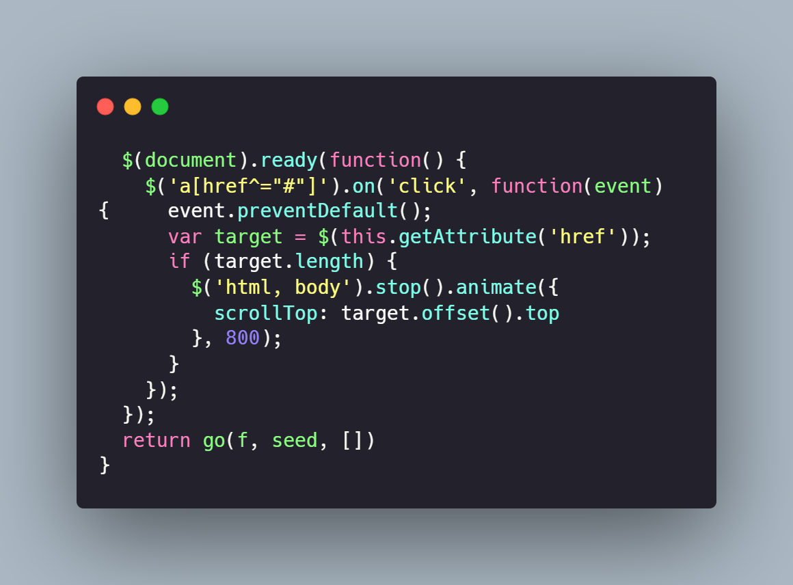

<p align="center">
  <a href="https://getbootstrap.com/">
    
  </a>
</p>

<h3 align="center">Projeto de Site Responsivo para Currículos</h3>
<p align="center">
  Este projeto é um site responsivo desenvolvido para exibir currículos de forma eficiente e dinâmica. O objetivo é criar um layout funcional, intuitivo e otimizado para diversos dispositivos.
  <br>
  <a href="https://github.com/Rfreitas01/site-responsivo-bootstrap/tree/main/TCC" style="display: inline-block; padding: 10px 15px; font-size: 12px; color: #fff; background-color:hsla(0, 0.00%, 5.50%, 0.40); text-align: center; text-decoration: none; border-radius: 5px; margin-top: 10px;"><strong>Explore o projeto no GitHub »</strong></a>
  <br>
</p>

 


## 🎯 Objetivo do Projeto

O projeto foi desenvolvido com o objetivo de criar um site simples e eficaz para apresentar currículos de forma adaptável a diferentes tamanhos de tela, utilizando boas práticas de design responsivo.

## 🛠️ Tecnologias Utilizadas

| Tecnologia | Descrição |
|------------|-----------|
| [HTML5](https://developer.mozilla.org/en-US/docs/Web/Guide/HTML/HTML5) | Estruturação do conteúdo |
| [CSS3](https://developer.mozilla.org/en-US/docs/Web/CSS) | Estilização e design |
| [Bootstrap](https://getbootstrap.com/) | Framework para responsividade |
| [JavaScript](https://developer.mozilla.org/en-US/docs/Web/JavaScript) | Funcionalidades dinâmicas |

## ✨ Funcionalidades

- 📱 **Layout Responsivo**: Adapta-se a diferentes tamanhos de tela
- 📝 **Seções Personalizadas**: Informações pessoais, experiência profissional, educação, habilidades e contatos
- 📤 **Formulário de Envio**: Submissão de currículos
- 🌐 **Integração Social**: Conexão com redes sociais

## 📂 Estrutura do Projeto

```plaintext
css/
imagens/
Javascript/
index.html
License
prompts.md
README.MD
```
## Codigo Javascript


<p align="">
  <br/>
  
</p>

## 🛠️ Ferramentas Utilizadas

| Ferramenta | Descrição |
|------------|-----------|
| [Visual Studio Code](https://code.visualstudio.com/) | Um editor de código-fonte leve e poderoso, versão 1.60.0 |
| [Git](https://git-scm.com/) | Sistema de controle de versão distribuído, versão 2.33.0 |
| [GitHub](https://github.com/) | Plataforma de hospedagem de código-fonte e controle de versão |
| [Node.js](https://nodejs.org/) | Ambiente de execução JavaScript server-side, versão 14.17.6 |
| [npm](https://www.npmjs.com/) | Gerenciador de pacotes para Node.js, versão 6.14.15 |
| [Bootstrap](https://getbootstrap.com/) | Framework front-end para desenvolvimento de interfaces responsivas, versão 4.6.0 |
| [Google Chrome](https://www.google.com/chrome/) | Navegador web utilizado para testes e desenvolvimento, versão 93.0 |

## Como Usar

1. Clone o repositório: `git clone https://github.com/seu-usuario/seu-repositorio.git`
2. Navegue até o diretório do projeto: `cd site-responsivo-bootstrap`
3. Abra o arquivo `index.html` no seu navegador preferido

## Contribuição

Contribuições são bem-vindas! Sinta-se à vontade para abrir issues e pull requests.


## Contato

Para mais informações, entre em contato pelo email: [ricardogenesi22@gmail.com](mailto:ricardogenesi22@gmail.com)

## Licença

Este projeto está licenciado sob a Licença MIT. Veja o arquivo [Linceça](Linceça) para mais detalhes.


## 👨‍💻 Autor

Ricardo


